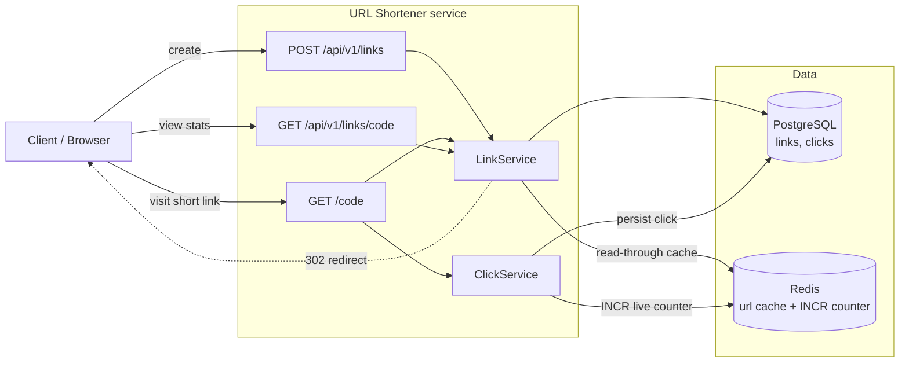

# System

## Hot path: `GET /{code}`
1. `LinkService.resolve(code)` checks Redis (`url:{code}`); on miss, reads Postgres
   and populates the cache with a TTL.
2. `ClickService.record(...)` inserts a `clicks` row and `INCR`s the Redis live
   counter `clicks:{code}`.
3. Respond `302 Found` with `Location: originalUrl`.

Postgres remains the source of truth for analytics; Redis only accelerates reads.
